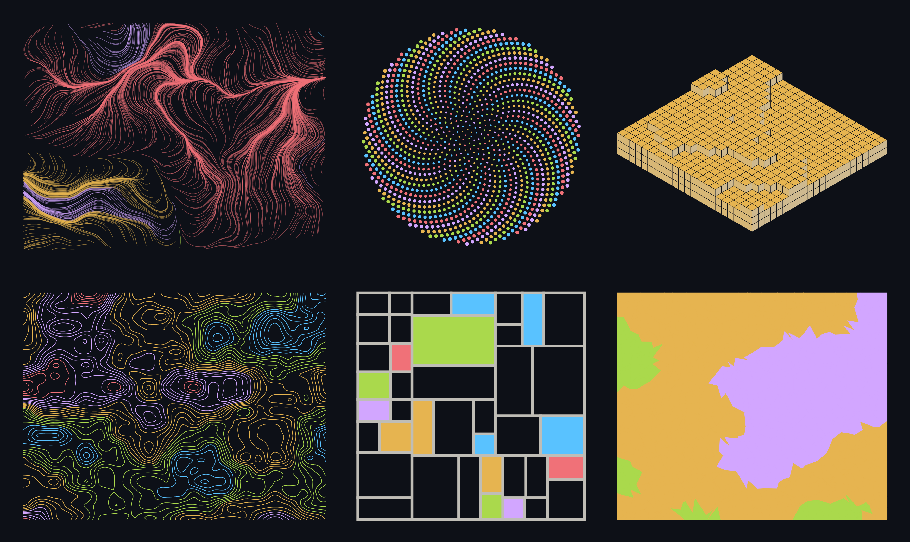
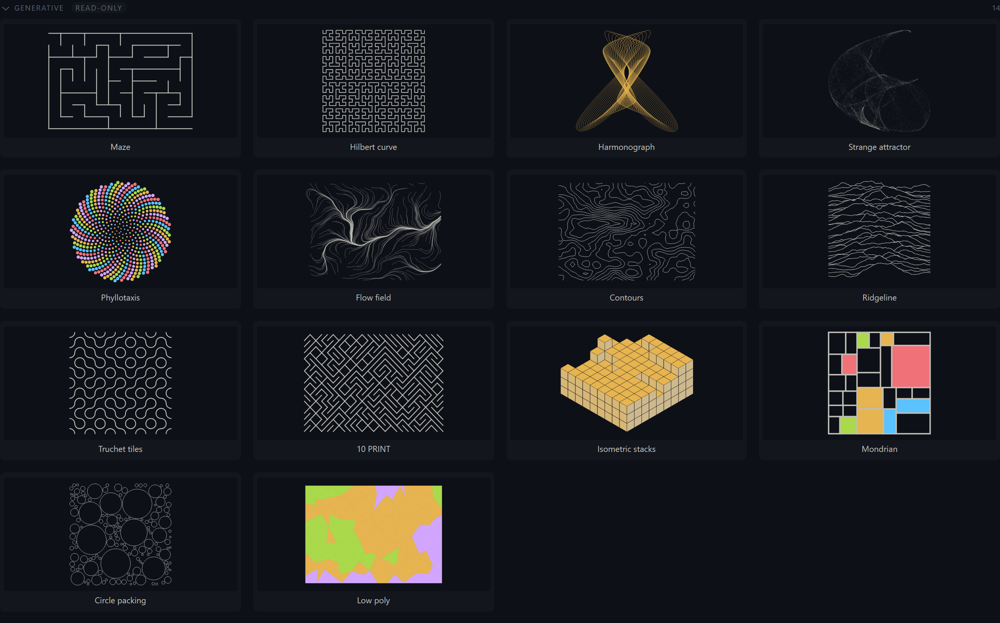

# swcad-generative

Fourteen components for [swcad](https://github.com/megashrieks/swcad) that have no stored drawing.
Give one a size and a seed and it draws itself: the maze is carved, the contours are traced from a
noise field, the attractor is iterated, the circles are packed. Nothing is baked into the file —
change the seed and you get a different one, resize it and it is recomputed rather than stretched.

They are the least practical thing in the swcad ecosystem and the best demonstration of what a
component script can do, which is why they exist.

## Example



## Components



| Reference | Name | Kind | What it is |
|---|---|---|---|
| `generative/maze` | Maze | node | A perfect maze carved from a seed. The walls are never stored, only the numbers that make them — and a connector dropped across it will find its way through. |
| `generative/hilbert` | Hilbert curve | node | A space-filling curve. One unbroken line visits every cell of a 2^n grid without ever crossing itself, and each order folds the previous one into a quarter of the frame. |
| `generative/harmonograph` | Harmonograph | node | The figure a pair of decaying pendulums draws. Four sine waves, two per axis, slightly out of tune with each other so the loop never quite closes and the trace precesses as it fades. |
| `generative/attractor` | Strange attractor | node | A point is fed through the same two equations over and over. It never repeats and never escapes, and the shape it wears into the frame is the attractor. Four numbers decide everything. |
| `generative/phyllotaxis` | Phyllotaxis | node | The spiral a sunflower head packs its seeds into. Each new floret is turned by the golden angle from the last, which is the only rotation that never lines up into spokes. |
| `generative/flow-field` | Flow field | node | Particles dropped into a noise field and left to drift. Each one follows the local angle step by step, and where the field bunches up the traces braid together. |
| `generative/contours` | Contours | node | A contour map of a landscape that was never surveyed. Marching squares traces the level lines of a noise field, one closed loop per height. |
| `generative/ridgeline` | Ridgeline | node | Stacked ridges, each one hiding the part of the ridge behind it. The Joy Division plot: the same signal read many times, drawn front to back. |
| `generative/truchet` | Truchet tiles | node | One tile, dropped into a grid at a random turn each time. Nothing joins anything on purpose, yet the arcs run into each other and long looping paths appear out of nowhere. |
| `generative/ten-print` | 10 PRINT | node | 10 PRINT CHR$(205.5+RND(1)); : GOTO 10 — the one-line Commodore 64 program. A coin flip per cell picks a slash or a backslash, and a maze that is not a maze falls out. |
| `generative/isometric` | Isometric stacks | node | A city of cubes on an isometric grid, stacked to a noise-driven skyline. Three faces, three shades, and a painter's-algorithm draw order doing all the work of a depth buffer. |
| `generative/mondrian` | Mondrian | node | A rectangle split, and split again, until the pieces are small enough to stop. A few of them get colour and the rest stay white — the composition is entirely in where the cuts fall. |
| `generative/circle-packing` | Circle packing | node | Circles dropped one at a time, each grown until it touches something. The early ones get the room and the late ones fill the gaps, so the scale sorts itself out. |
| `generative/lowpoly` | Low poly | node | A jittered mesh of triangles, each one flat-shaded from a noise field. Faceted, like a paper model of a landscape nobody folded. |

## Installing it

swcad reads libraries from three places: the ones that ship with the app, the ones you have
installed, and a `libs/` folder inside a project. This one is installed.

Open the **Libraries & plugins** tab in the left rail, paste the repository URL into the box at
the top and press **Install**:

```
https://github.com/megashrieks/swcad-generative
```

swcad clones it into `~/swcad_libraries/`, checks that a `library.json` sits at the root and
reloads the palette. **Update** pulls the latest commit; **Remove** moves the folder to the
trash. Installed libraries are read-only in the editor, because an edit in place would make the
next update refuse to fast-forward — copy the folder into your project's `libs/` if you want to
change something.

## Licence

MIT, see [LICENSE](LICENSE).
